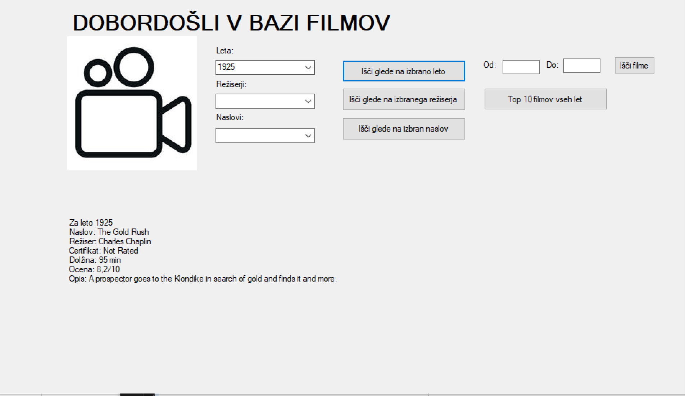

## Poročilo za Programiranje 3 - SQL v C#
* Avtor : Urša Kumelj  
* Datum : 7.5.2024

Za izdelavo obeh vmesnikov sem rabila en cel dan. Vse skupaj je bilo sprva težje, ko pa sem dojela, kako stvar deluje, je delo potekalo precej hitreje. Definitivno bi si vzela še več časa, če se ne bi bližali ustni izpiti, saj je stvar zelo uporabna. Naučila sem se kako podatke, ki jih uporabnik vnese, uporabimo za parametre in izpišemo željeno. Na splošno sem se naučila povezati delo z bazami z Windows Forms. 

# Zaslonske slike za Nobelove nagrajence:
1. Ko izberemo področje in leto nam izpiše nagrajence:

2. Ko izberemo nagrajenca nam izpiše leto in področje zanj:

3. Ko izberemo leto in kliknemo išči glede na izbrano leto, dobimo izpis kot kaže slika:

4. Ko izberemo režiserja in kliknemo išči glede na izbranega režiserja, dobimo spodnji izpis:

5. Ko izberemo naslov filma in kliknemo išči glede na izbran naslov, dobimo spodnji izpis:

6. Ko vpišemo leta od in do ter kliknemo išči filme, nam izpiše vse naslove filmov med tema dvema letoma:

7. Ko kliknemo na gumb top 10 filmov vseh let, nam izpiše 10 filmov, ki imajo oceno med 9 in 10.
